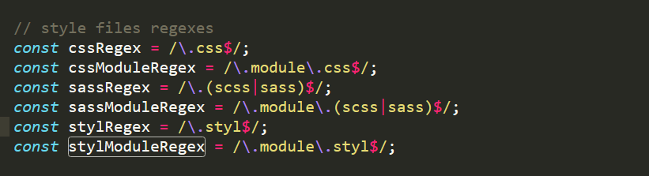
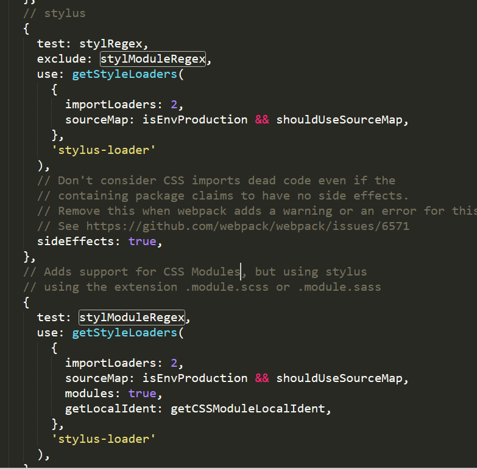

#### 前言

在react中需要css的模块化。在vue中习惯了，开箱即用scoped,并且沉迷于[stylus](http://stylus-lang.com/)的简洁。迫切需要在react中用上stylus。

ceate-react-app创建的react项目，可以用css,scss的模块化。

本文参考[CSS Modules 入门及实践](http://www.alloyteam.com/2017/03/getting-started-with-css-modules-and-react-in-practice/#prettyPhoto)
<!--more-->

##### react中使用 scss
创建 style.module.scss
组件js中 
```
import styles from './style.module.scss'

<div className={styles.myname}></div>

```
如此，便可以用上模块化使用css。

这都是得益于[CSS Modules](https://github.com/css-modules/css-modules)

##### react中使用 stylus

需要把react的webpack配置暴露出来。

npm run reject

安装 stylus ，stylus-loader

找到暴露出来的配置文件目录 config>webpack.config.js
找到module:{} 添加 stylus-loader，stylus的解析即可。




创建 style.module.styl
组件js中 
```
import styles from './style.module.styl'

<div className={styles.myname}></div>

```
至此 happy 使用 stylus吧。


