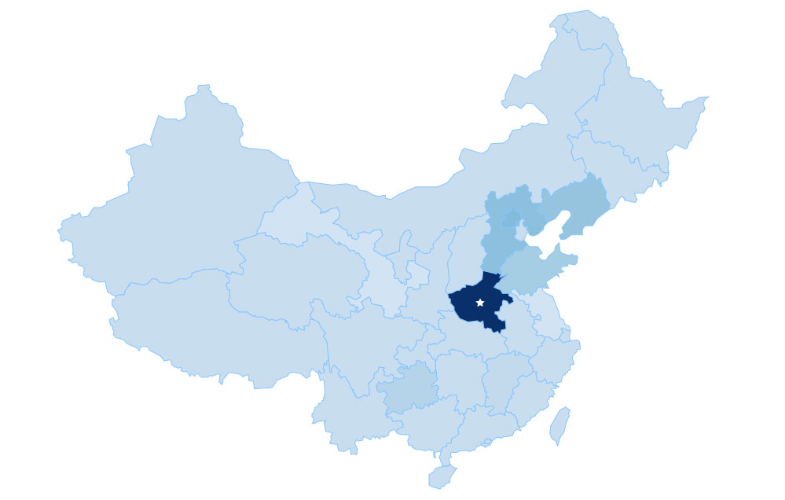

#### 文档请戳 [文档 https://d3js.org.cn/document](https://d3js.org.cn/document)


地图需要传入地图经纬度数据。[中国地图经纬度数据 ](../../data/china.geo.js)

```bash
 // data = china.map.json
 let svg = d3.select('.dom').append('svg')
 let g = svg.append('g')
 let len = data.length
 g.selectAll('path')
   .data(data.features)
   .enter()
   .append('path')
   .attr('d', path)
   .attr('fill', function(i) {
     return d3.interpolateBlues(i / len)
   })
   .attr('stroke', '#86C5FE')
   .attr('stroke-width', 1)
```
