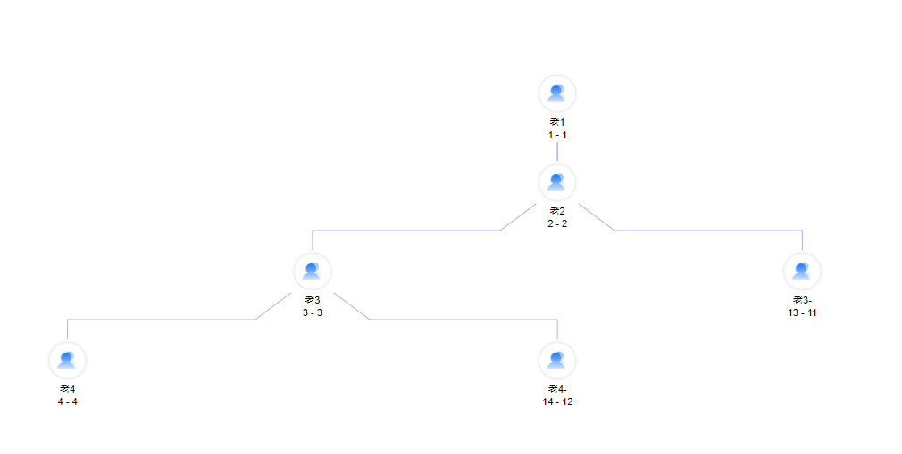

#### 文档请戳 [文档 https://d3js.org.cn/document](https://d3js.org.cn/document)

```bash
 // 把数据 转为层次结构数据:
 let root = d3.stratify()
   .id((d) => {
     return d.id;
   })
   .parentId((d) => {
     return d.parentId;
   })(this.nodes);

 let depth = 0;
 this.hierarchyData = d3.hierarchy(root)
   .sum((d) => {
     depth = d.depth > depth ? d.depth : depth
     return d.value
   })

 let tree = d3.tree().size([this.width, this.height])
 let treeData = tree(this.hierarchyData)

 this.zoom = d3.zoom()
   .scaleExtent(this.scale)
   .translateExtent([
     [0, 0],
     [this.width, this.height]
   ])
   .extent([
     [0, 0],
     [this.width, this.height]
   ])
   .on('zoom', this.zoomed)

 this.g = this.svg.append('g')

 this.drawNodes(treeData.descendants())
 this.drawLinks(treeData.links())
 this.drawText();
 // zoom
 this.svg.call(d3.zoom().on("zoom", this.zoomed))
   .on("dblclick.zoom", null);
```
