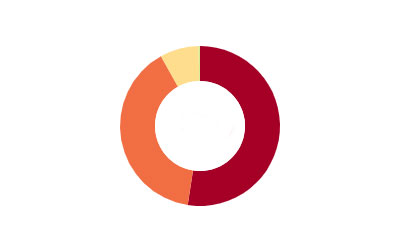

#### 文档请戳 [文档 https://d3js.org.cn/document](https://d3js.org.cn/document/d3-shape/#arcs)



+ 交互：鼠标放上去饼图部分变大。
+ 颜色部分用 interpolateRdYlGn
有许多颜色可用 具体看 [d3 color](https://d3js.org.cn/document/d3-scale-chromatic/#api-reference)

```bash

 let pie = d3.pie()
   .value((d) => {
     return d.value
   })
   .sortValues(null)

 let line = d3.line()
   .x((d) => {
     return d.x
   })
   .y((d) => {
     return d.y
   })

 let arc = d3.arc()
   .innerRadius(inR)
   .outerRadius(ouR)

 let arc2 = d3.arc()
   .innerRadius(inR)
   .outerRadius(ouR + 15)

 let sum = 0;

 let g = this.svg.append('g')
   .attr("transform", "translate(" + parseInt(this.width / 2) + "," + parseInt(this.height / 2) + ")")

 g.selectAll('g')
   .data(pie(pieData))
   .enter()
   .append('g')
   .each(function(d, i) {
     let color = d3.interpolateRdYlGn(i / pieData.length);
     d3.select(this)
       .append('path')
       .attr('fill', color)
       .on("mouseover", function(d) {
         d3.select(this)
           .transition()
           .duration(100)
           .attr("d", arc2(d))
         //do something
       })
       .on("mouseout", function(d) {
         d3.select(this)
           .transition()
           .duration(100)
           .attr("d", arc(d))
         //do something
       })
       .transition()
       .delay(sum)
       .duration((d, i) => {
         let duration = parseInt(420 * (d.value / dataSum));
         sum += duration
         return duration;
       })
       .attrTween("d", function(d, j) {
         let i = d3.interpolate(d.startAngle, d.endAngle);
         return function(t) {
           d.endAngle = i(t);
           return arc(d);
         }
       })

   })
```

已经半径，角度，求中心点。
```bash
function getRoundPoint(r, angle) {
   return [
     r * Math.cos(angle),
     r * Math.sin(angle)
   ]
 }
```
