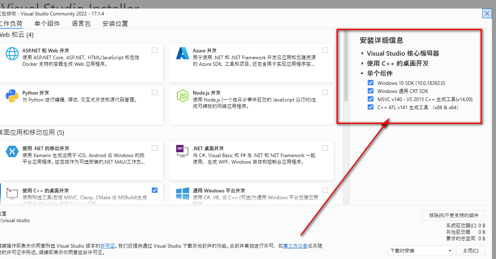

superset 在windows 环境中安装，可以通过python虚拟环境配置，记录备忘一下。

#### **环境注意事项**
安装过程中各种错误，安装如下可解决。
需要额外下载好visual studio 的相关插件。好像单个组件不选也可以。
<!-- more -->
#### **具体步骤：**
详细可以查看[superset 官方文档](https://superset.apache.org/docs/installation/installing-superset-from-scratch) 或者 [GitHub CONTRIBUTING](https://github.com/apache/superset/blob/master/CONTRIBUTING.md#documentation)

1、安装python，下载exe安装，记得勾选，配置环境变量
```bash
# 2、安装虚拟环境 
pip install virtualenv 
# 3、在需要开启虚拟环境的目录下执行。
py -3 -m venv venv || python3 -m venv venv 
```
  tips: 在项目目录下执行, python3 可以用的前提是python的安装目录有个python3.exe
  常见错误： python3 不是内部外部命令，不能识别。用 **py -3** 代替。如果需要使用，需要复制python.exe 后重命名 python3.exe
```bash
# 4、开启虚拟化
venv\Scripts\activate 
# 5、安装superset 可以选择版本安装。
pip install apache-superset==2.0.1 // --use-deprecated=legacy-resolver
   #tips: 如果superset对应的版本已经下载下来，且虚拟目录在项目中开启，则可忽略此步骤。
```
5、安装需要的package（以下2个步骤好像选一个就可以了?)
```bash
pip install -r requirements/testing.txt
# Install Superset in editable (development) mode
pip install -e .
```
6、 配置后端服务
```bash
# (别的位置看到的)
set flask = superset 
# Initialize the database
superset db upgrade

# Create an admin user in your metadata database (use `admin` as username to be able to load the examples)
superset fab create-admin

# Create default roles and permissions
superset init

# Load some data to play with.
# Note: you MUST have previously created an admin user with the username `admin` for this command to work.
superset load-examples

# Start the Flask dev web server from inside your virtualenv.
# Note that your page may not have CSS at this point.
# See instructions below how to build the front-end assets.
FLASK_ENV=development superset run -p 8088 --with-threads --reload --debugger
```

#### 常见错误
+ 环境报错，需要安装好环境注意事项的包。
1、fatal error C1083: Cannot open include file: 'basetsd.h'致命错误 C1083：无法打开包含文件：“basetsd.h”
fatal error C1083: 无法打开包括文件: “basetsd.h”: No such file or directory
2、error: command 'D:\\visual studio\\VC\\Tools\\MSVC\\14.31.31103\\bin\\HostX86\\x64\\cl.exe' failed with exit code 2
3、error: legacy-install-failure
4、src/geohash.cpp(2): fatal error C1083: 无法打开包括文件: “stdio.h”: No such file or directory
5、Command errored out with exit status 1:
6、 pip is looking at multiple versions of dnspython to determine which version is compatible with other requirements. This could take a while.


+ 安装requirements.txt 报错
ERROR: Could not open requirements file: [Errno 2] No such file or directory: ‘requirments.txt’
解决办法：
  先执行pip freeze > requirements.txt//会在当前目录下生成文件。 管理包版本
  然后再pip install -r requirements.txt

一直各种包之间冲突，没有成功，在issue上看到分享说，2.0.1版本在3.9以上不能成功配置，有网友分享3.8可用，在尝试ing
各种倒腾，到最后说网络不行，不能 superset load_examples。 郁闷死。。。
继续进行下一步，起来了，但是登录上去是坏的。。。


### python 虚拟环境

[文档](https://superset.apache.org/docs/installation/installing-superset-from-scratch)
1、安装python 下载exe安装 //配置环境变量

2、pip install virtualenv 
3、py -3 -m venv venv //python3 -m venv venv (在项目目录下执行)
 错误： 
 ，python3 不是内部外部命令，不能识别。用 **py -3** 代替。如果需要使用，需要复制python.exe 后重命名 python3.exe
4、venv\Scripts\activate //. venv/bin/activate 开启虚拟化
  deactivate //退出虚拟化

5、 pip install apache-superset==2.0.1 --use-deprecated=legacy-resolver

安装过程中各种错误，安装如下可解决。
需要额外下载好visual studio 的相关插件。
+ 错误1：
fatal error C1083: Cannot open include file: 'basetsd.h'致命错误 C1083：无法打开包含文件：“basetsd.h”
fatal error C1083: 无法打开包括文件: “basetsd.h”: No such file or directory
+ 错误2.
 error: command 'D:\\visual studio\\VC\\Tools\\MSVC\\14.31.31103\\bin\\HostX86\\x64\\cl.exe' failed with exit code 2
+ 错误3.
 error: legacy-install-failure
+ 错误4.
 src/geohash.cpp(2): fatal error C1083: 无法打开包括文件: “stdio.h”: No such file or directory
+ 错误5.
  Command errored out with exit status 1:
+ 错误6.
  pip is looking at multiple versions of dnspython to determine which version is compatible with other requirements. This could take a while.

  tips: 第5步在项目目录下可不安装(待我的确认)

6、安装requirements.txt 错误：
ERROR: Could not open requirements file: [Errno 2] No such file or directory: ‘requirments.txt’
  先执行pip freeze > requirements.txt//会在当前目录下生成文件。 管理包版本
  然后再pip install -r requirements.txt

一直各种包之间冲突，没有成功，在issue上看到分享说，2.0.1版本在3.9以上不能成功配置，有网友分享3.8可用，在尝试ing
各种倒腾，到最后说网络不行，不能 superset load_examples。 郁闷死。。。
继续进行下一步，起来了，但是登录上去是坏的。。。


错误：ModuleNotFoundError: No module named ‘pip
先解决 ModuleNotFoundError: No module named ‘pip‘
先把pip装回来：
python -m ensurepip


#### python 版本切换
切换python版本，[参照文档](https://blog.csdn.net/qq_42455308/article/details/129263694)
安装不一样的版本，可切换版本使用。再走一遍。

python38 install virtualenv

错误：ERROR: After October 2020 you may experience errors when installing or updating packages 
解决：pip install apache-superset --use-feature=2020-resolver

pip install sqlalchemy-utils==0.36.6 --use-feature=2020-resolver -i https://pypi.douban.com/simple/


错误：
Found but failed to import local superset_config
....
OSError: The environment variable DATABASE_DIALECT was missing, abort...
解决:
 之前不小心配置环境变量PYTHONPATH(本人小心学习中。。。），删除了就好了

错误：
Init superset fail with error 'No module named 'cryptography.hazmat.backends.openssl.x509'
解决办法： 参考 [GitHub issue](https://github.com/apache/superset/issues/22571)
参考 [stackoverflow 32518458](https://stackoverflow.com/questions/32518458/importerror-no-module-named-cryptography-hazmat-bindings-openssl)
--- 就是包不兼容。

```bash
 pip uninstall -y markupsafe
 pip install markupsafe==2.0.1
 pip uninstall -y Werkzeug
 pip install Werkzeug==2.0.3

pip install flask==2.1.0
# 数据库用上的 
pip install pibow
# 不确定这个有用
pip install pyopenssl==22.1.0
```

# 前端服务起来
 安装nodejs 16.19.1 报错少。别的版本的错误巨多。
 ```bash
 # cd superset-frontend
 npm install 
 # 默认启用的9000 端口，后端服务用的flask服务起的。
 npm run dev 
 ````


