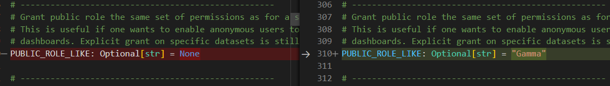
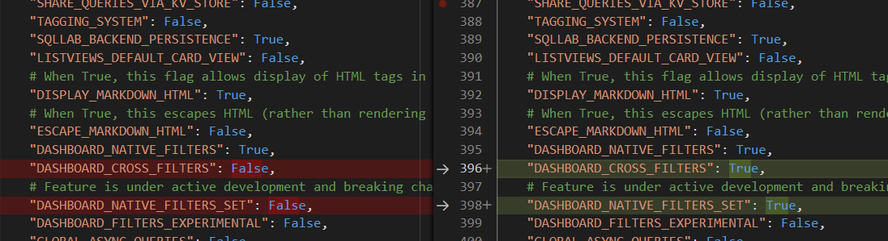

本次配置适用于superset 2.0.1版本。
#### 修改配置文件 config.py 

```bash
PUBLIC_ROLE_LIKE: Optional[str] = "Gamma"
DASHBOARD_CROSS_FILTERS = true
DASHBOARD_NATIVE_FILTERS_SET = true
```



#### 重新初始化

```bash
# 重新初始化
superset init 
# 开启服务
superset run -h 0.0.0.0 -p 8088 --with-threads --reload --debugger
```

#### 配置权限

登录后，配置权限。

就可以了


参考[阿里云分享](https://developer.aliyun.com/article/1047644)的第二种办法。