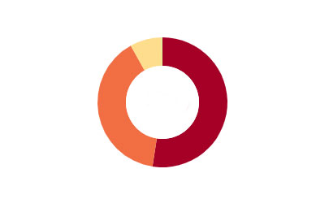
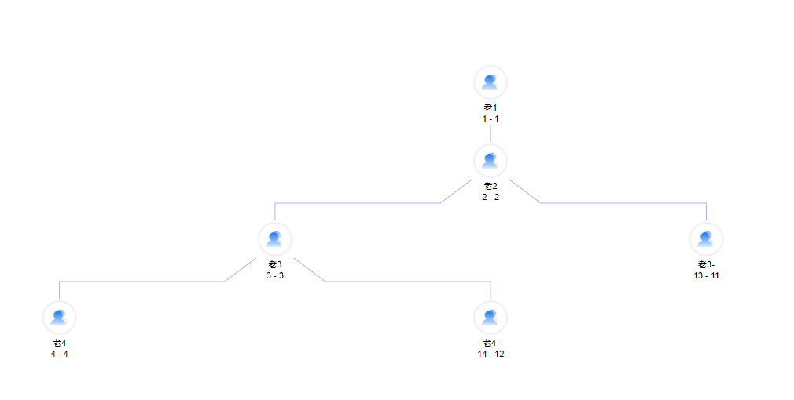
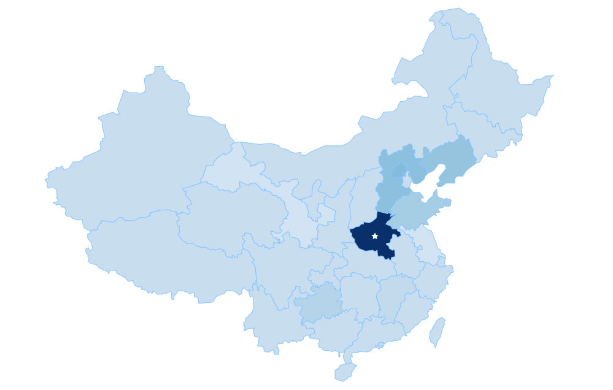

#### 官方文档 [官方文档 ](https://d3js.org.cn/document)

#### 环形饼图


<!--more-->
+ 交互：鼠标放上去饼图部分变大。
+ 颜色部分用 interpolateRdYlGn
有许多颜色可用 具体看 [d3 color](https://d3js.org.cn/document/d3-scale-chromatic/#api-reference)

```javaScript

 let pie = d3.pie()
   .value((d) => {
     return d.value
   })
   .sortValues(null)

 let line = d3.line()
   .x((d) => {
     return d.x
   })
   .y((d) => {
     return d.y
   })

 let arc = d3.arc()
   .innerRadius(inR)
   .outerRadius(ouR)

 let arc2 = d3.arc()
   .innerRadius(inR)
   .outerRadius(ouR + 15)

 let sum = 0;

 let g = this.svg.append('g')
   .attr("transform", "translate(" + parseInt(this.width / 2) + "," + parseInt(this.height / 2) + ")")

 g.selectAll('g')
   .data(pie(pieData))
   .enter()
   .append('g')
   .each(function(d, i) {
     let color = d3.interpolateRdYlGn(i / pieData.length);
     d3.select(this)
       .append('path')
       .attr('fill', color)
       .on("mouseover", function(d) {
         d3.select(this)
           .transition()
           .duration(100)
           .attr("d", arc2(d))
         //do something
       })
       .on("mouseout", function(d) {
         d3.select(this)
           .transition()
           .duration(100)
           .attr("d", arc(d))
         //do something
       })
       .transition()
       .delay(sum)
       .duration((d, i) => {
         let duration = parseInt(420 * (d.value / dataSum));
         sum += duration
         return duration;
       })
       .attrTween("d", function(d, j) {
         let i = d3.interpolate(d.startAngle, d.endAngle);
         return function(t) {
           d.endAngle = i(t);
           return arc(d);
         }
       })

   })
```
#### 树形图

```javaScript
 // 把数据 转为层次结构数据:
 let root = d3.stratify()
   .id((d) => {
     return d.id;
   })
   .parentId((d) => {
     return d.parentId;
   })(this.nodes);

 let depth = 0;
 this.hierarchyData = d3.hierarchy(root)
   .sum((d) => {
     depth = d.depth > depth ? d.depth : depth
     return d.value
   })

 let tree = d3.tree().size([this.width, this.height])
 let treeData = tree(this.hierarchyData)

 this.zoom = d3.zoom()
   .scaleExtent(this.scale)
   .translateExtent([
     [0, 0],
     [this.width, this.height]
   ])
   .extent([
     [0, 0],
     [this.width, this.height]
   ])
   .on('zoom', this.zoomed)

 this.g = this.svg.append('g')

 this.drawNodes(treeData.descendants())
 this.drawLinks(treeData.links())
 this.drawText();
 // zoom
 this.svg.call(d3.zoom().on("zoom", this.zoomed))
   .on("dblclick.zoom", null);
```
#### 中国地图

地图需要传入地图经纬度数据。[中国地图经纬度数据 ](../../data/china.geo.js)

```javaScript
 // data = china.map.json
 let svg = d3.select('.dom').append('svg')
 let g = svg.append('g')
 let len = data.length
 g.selectAll('path')
   .data(data.features)
   .enter()
   .append('path')
   .attr('d', path)
   .attr('fill', function(i) {
     return d3.interpolateBlues(i / len)
   })
   .attr('stroke', '#86C5FE')
   .attr('stroke-width', 1)
```
#### 渐变图例
+ color渐变 d3.interpolateBlues
+ defs linearGradient 做渐变背景


```javaScript
      let defs = this.svg.append("defs");
      let start = 20 ,width = 15,height = 130 ,pad = 50

      let linear = defs.append("linearGradient")
        .attr("id", "linearColor")
        .attr("x1", "0%")
        .attr("y1", "0%")
        .attr("x2", "0%")
        .attr("y2", "100%");

      linear.append("stop")
        .attr("offset", "0%")
        .style("stop-color", d3.interpolateBlues(1));

      linear.append("stop")
        .attr("offset", "100%")
        .style("stop-color", d3.interpolateBlues(num))

      this.svg.append('rect')
        .attr('x', start)
        .attr('y', this.height - height - pad)
        .attr('width', width)
        .attr('height', height)
        .style('fill', 'url(#linearColor')
      let g = this.svg.append('g')
      g.append('path')
        .attr('d', ()=>{
          let x = start + width
          let x1 = start + width + 11
          let y = this.height - height - pad
          let y1 = this.height - height - pad - 11
          return 'M ' + x + ' ' + y + ' L ' + x1 + ' ' + y + ' L ' + x1 + ' ' + y1 + ' Z ';
        })
        .style('fill', d3.interpolateBlues(1))

      g.append('path')
        .attr('d', ()=>{
          let x = start + width
          let x1 = start + width + 11
          let y = this.height  - pad
          let y1 = this.height  - pad + 11
          return 'M ' + x + ' ' + y + ' L ' + x1 + ' ' + y + ' L ' + x1 + ' ' + y1 + ' Z ';
        })
        .style('fill', d3.interpolateBlues(num))
      this.svg.append('text')
        .attr('x', start)
        .attr('y', this.height - height - pad)
        .attr('dx', 2)
        .attr('dy', -4)
        .text('高')
        .style('font-size', '11px')
      this.svg.append('text')
        .attr('x', start)
        .attr('y', this.height - pad)
        .attr('dx', 2)
        .attr('dy', 15)
        .text('低')
        .style('font-size', '11px')
```
#### 其他 
+ 已经半径，角度，求中心点。
```javaScript
function getRoundPoint(r, angle) {
   return [
     r * Math.cos(angle),
     r * Math.sin(angle)
   ]
 }
```
[例子戳 Github 地址](https://github.com/kokiers/d3charts)
