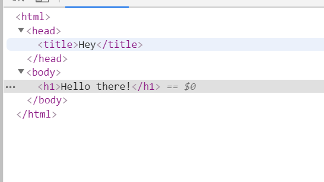

express 基于 Node.js 平台，快速、开放、极简的 Web 开发框架
[文档](http://www.expressjs.com.cn)

<!--more-->
#### 安装
```
npm install express
```
#### 启动服务
```
const server = require('express')();
server.get('/', function (req, res, next) {
  //do something
  // next()
})
server.listen(8084,()=>{
  console.log('server is on port 8084')
});
```
#### [router](http://www.expressjs.com.cn/en/starter/basic-routing.html)
app.METHOD(PATH, HANDLER)
+ app is an instance of express.
+ METHOD is an HTTP request method, in lowercase.
+ PATH is a path on the server.
+ HANDLER is the function executed when the route is matched.
```
app.get('/', function (req, res) {
  res.send('hello world')
})
```

#### middleware 中间件

##### use
```
var myLogger = function (req, res, next) {
  console.log('LOGGED')
  next()
}
app.use(myLogger)
```
##### Built-in middleware

+ [express.static](http://www.expressjs.com.cn/en/4x/api.html#express.static) serves static assets such as HTML files, images, and so on.
+ [express.json](http://www.expressjs.com.cn/en/4x/api.html#express.json) parses incoming requests with JSON payloads. NOTE: Available with Express 4.16.0+
+ [express.urlencoded](http://www.expressjs.com.cn/en/4x/api.html#express.urlencoded) parses incoming requests with URL-encoded payloads. NOTE: Available with Express 4.16.0+

[static](http://www.expressjs.com.cn/en/4x/api.html#express.static)
```
let options = {
  setHeaders: function (res, path, stat) {
    res.set('x-timestamp', Date.now())
  }
}
server.use(express.static('public', options))
```
#### 模板 template engines
pug
```
npm install pug

//serve.js
server.set('view engine', 'pug')
server.get('/', function (req, res) {
  res.render('index', { title: 'Hey', message: 'Hello there!' })
})
```


#### 调试DEBUG
```
lunix:DEBUG=express:* node index.js
window:set DEBUG=express:* & node index.js
```
更多文档，请查看[官方4x文档](http://www.expressjs.com.cn/en/4x/api.html)