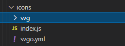

项目设计画了很多可爱的图标，导出来很多可爱的svg
在项目中怎么能很方便的引用svg呢？

嗯呐 就是
svg-sprite-loader

安装插件  svg-sprite-loader

#### 新建文件夹存放svg


<!--more-->

##### index.js 引入svg组件 注册。

``` bash
import Vue from 'vue'
import SvgIcon from '@/components/common/SvgIcon'// svg component

// register globally
Vue.component('svg-icon', SvgIcon)

const req = require.context('./svg', false, /\.svg$/)
const requireAll = requireContext => requireContext.keys().map(requireContext)
requireAll(req)
```

##### svgo.yml
配置svgo的配置  [文档可戳](https://github.com/svg/svgo)


####  svgicon 组件

```bash

<template>
  <div v-if="isExternal" :style="styleExternalIcon" class="svg-external-icon svg-icon" v-on="$listeners" />
  <svg v-else :class="svgClass" aria-hidden="true" v-on="$listeners">
    <use :xlink:href="iconName" />
  </svg>
</template>

<script>
// doc: https://panjiachen.github.io/vue-element-admin-site/feature/component/svg-icon.html#usage
function isExternal(path) {
  return /^(https?:|mailto:|tel:)/.test(path)
}

export default {
  name: 'SvgIcon',
  props: {
    iconClass: {
      type: String,
      required: true
    },
    className: {
      type: String,
      default: ''
    }
  },
  computed: {
    isExternal() {
      return isExternal(this.iconClass)
    },
    iconName() {
      return `#icon-${this.iconClass}`
    },
    svgClass() {
      if (this.className) {
        return 'svg-icon ' + this.className
      } else {
        return 'svg-icon'
      }
    },
    styleExternalIcon() {
      return {
        mask: `url(${this.iconClass}) no-repeat 50% 50%`,
        '-webkit-mask': `url(${this.iconClass}) no-repeat 50% 50%`
      }
    }
  }
}
</script>

<style scoped>
.svg-icon {
  width: 16px;
  height: 16px;
  fill: currentColor;
  overflow: hidden;
}

.svg-external-icon {
  vertical-align: middle;
  background-color: currentColor;
  mask-size: cover!important;
  display: inline-block;
}
</style>


 #  index.js 注册全局组件。
import Vue from 'vue'
import SvgIcon from '@/components/common/SvgIcon'// svg component

// register globally
Vue.component('svg-icon', SvgIcon)

const req = require.context('./svg', false, /\.svg$/)
const requireAll = requireContext => requireContext.keys().map(requireContext)
requireAll(req)

```

#### 最后再引入svg的index.js使用 