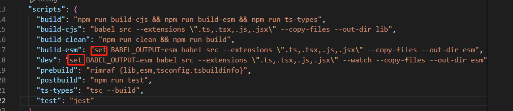

 #### 起一个本地静态服务
 `npx http-server` //默认 8080
 `npx http-server -p 8900` //指定端口号8900
<!-- more -->
 InputFormatter(r"^((([1-9])|([1-9][0-9]))(.[1-9])?)$"),


#### 升级包
```bash
 npm update -g @vue/cli
# 或者
 yarn global upgrade --latest @vue/cli
```

#### npm 安装失败处理
1. 删除 node_moduces
2. 删除package-lock.json
3. 清除缓存
```bash
npm cache clean -f
npm cache clean --force
```
4.npm install
#### npm 其他
+ -S  等同于--save，保存在package.json文件中，是在dependencies 下，
+ -D  等同于--save-dev，也保存在package.json文件中，是在devDependencies下，
+ -g  等同于--global的简写，对模块进行全局安装，作用于全局环境下，

####  BABEL_OUTPUT is not a recognised commmand
描述：superset 新建插件的时候，执行命令弹出这个错误。
解释：需要 设置 BABEL_OUTPUT 环境变量
解决：**BABEL_OUTPUT** 前面加上 set || 删除 **BABEL_OUTPUT=esm** 参考[stackoverflow](https://stackoverflow.com/questions/26262196/debug-is-not-a-recognized-command-express)



#### patch-package
 对npm 依赖项进行修复。

+ 安装 patch-package
+ 修改node_modules中的依赖 package-name
+ 生成 patch 文件记录修改 ：yarn patch-package package-name
+ 提交生成的 patch文件夹，这样可以方便团队合作开发。

#### 安装报错
`Could not resolve dependency:
npm ERR! peer typescript@">=3.4 <4.0" from ts-jest@25.5.1`

报错原因
在新版本的npm中 默认情况下npm install遇到冲突的peerDependencies时将失败。
解决办法
使用** --force **或 **--legacy-peer-deps **可解决这种情况。
+ --force 会无视冲突并强制获取远端npm库资源当有资源冲突时覆盖掉原先的版本。
+ --legacy-peer-deps安装时忽略所有peerDependencies忽视依赖冲突采用npm版本4到版本6的样式去安装依赖已有的依赖不会覆盖。
建议用--legacy-peer-deps 比较保险一点
