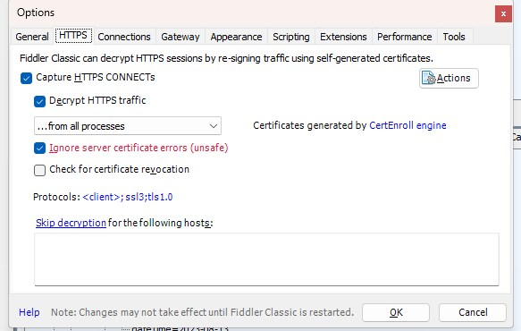
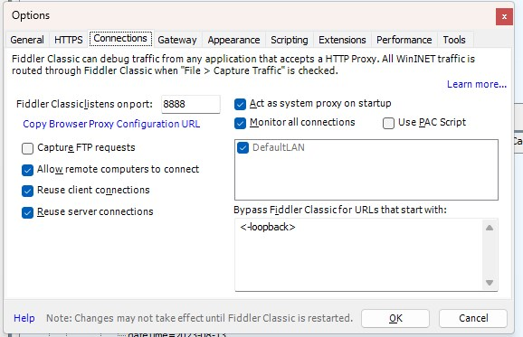
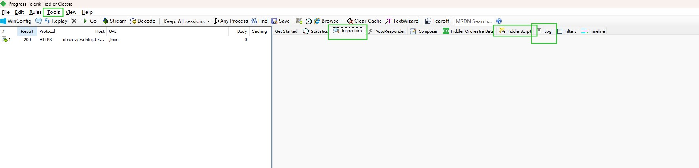

这几年一直做的PC端开发，mobile 端的开发几乎没碰了。今年换了坑，又涉及到H5，又把抓包的工具拾起来，多年前的记录又攻击过来了，哈哈。
我常用的抓包工具有 anyproxy ， Fiddler.
<!-- more -->

### anyproxy
AnyProxy是一个基于NodeJS的，可供插件配置的HTTP/HTTPS代理服务器 , alibaba 出品。 [Github alibaba](https://github.com/alibaba/anyproxy)

#### 安装
`npm install anyproxy `

#### 配置
1、启动服务 `anyproxy`
2、打开本地地址 http://localhost:8002/  默认开启监听端口 Http proxy started on port 8001 ，查看抓包详情查看  web interface started on port 8002 端口
3、下载证书  
4、安装证书 
5、信任证书

#### 使用
1、手机+电脑同处一个局域网。
2、手机联网 设置代理ip 端口号,在手机上进行操作。
3、在http://localhost:8002/ 即可查看抓包详情啦。
4、需要解析HTTPS时，用intercept参数来启动anyproxy `anyproxy --intercept`

其他配置，比如设置代理 https rule。可查看GitHub操作细则。


### Fiddler
1、下载安装[Download Fiddler Classic](https://www.telerik.com/download/fiddler)
2、配置 Tools -> options



3、下载证书  。手机下载，设置代理，访问  conections 步骤中设置的端口号
4、安装证书 
5、信任证书 


其他设置： 
可以在 **Fiddler script** 设置外观
比如在 `OnBeforeRequest` 中设置
```JS
var hostsTest = 'www.baidu.com'
if(hostsTest.indexOf(oSession.host) > -1){
    oSession["ui-backcolor"] = "Orange"; 
}
```